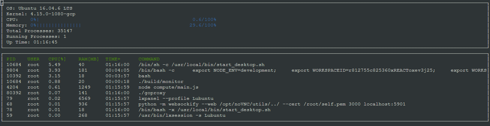

# C++
Some examples of my projects in C++ from game programmation, to path finding algorithms. 

* * *
## Game Programming : Ubisoft Womxn Programming 

> WomXn Develop At Ubisoft is a mentoring program that aims to attract and develop diverse talents for Ubisoft studios around the world.

From february to may, I was mentored by a Lead Gameplay Programmer from Ubisoft in order to prototype a game. My major focus was on the gameplay part.

Theme was Reborn, so I headed to a plateformer/puzzle where the deadbodies are the main clues to finish a level. 

__Technologies__: 
+ SFML : [Simple and Fast Multimedia Library](https://www.sfml-dev.org/)
+ ImGui : Graphical User Interface for C++ [[lien github](https://github.com/ocornut/imgui)]

[Simple Game Design Document](https://drive.google.com/file/d/1O0Ac06Ke82EVLZGDs-N7JoixQQ94ngwD/view?usp=sharing){:target="_blank" rel="noreferrer noopener"}

In Game Gif.

Code can be found on my github : [9LIVES](https://github.com/ChrisDal/ubiwmxn-game/tree/v2.21){:target="_blank" rel="noreferrer noopener"}

* * *

## System Monitor (Udacity Program)

__Objective__: Monitoring a Linux System

__Competence__: Files Parsing, String  

[Code on Github](https://github.com/ChrisDal/CppND-System-Monitor-Project-Updated){:target="_blank" rel="noreferrer noopener"}

* * *

## Open Street map (Udacity Program)

__Objective__: Determine the shortest path from a point A to B on a open-street map

__Competence__: Path Finding 

[Code on Github](https://github.com/ChrisDal/CppND-Route-Planning-Project/tree/master/src){:target="_blank" rel="noreferrer noopener"} 

* * *

## ChatBot (Udacity Program )

__Objective__: Modify the structure of the code use smart pointers 

__Competence__: Smart Pointers and Ownership

Code on Github 